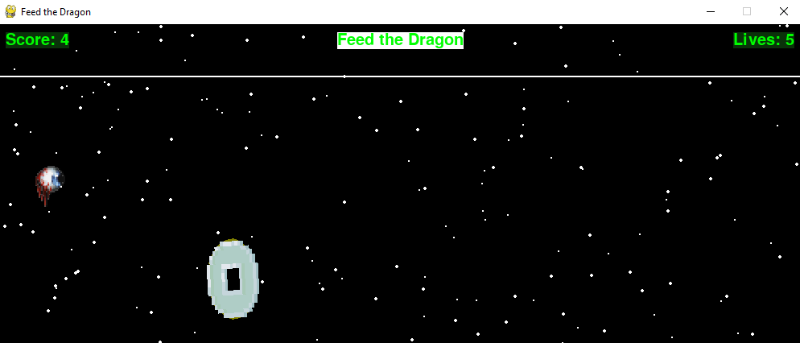

# Coin Grabber Game

Welcome to **Coin Grabber Game**! This project was created as part of my **Computer Graphics** class during my second year of college. The game is built using **Python** with the help of the **Pygame** and **random** modules.

## 🎮 About the Game
Coin Grabber is a simple, fun, and engaging game where the objective is to collect as many coins as possible while navigating the game environment. It demonstrates core computer graphics concepts, such as rendering, animations, and event handling, implemented using the Pygame library.

## 🚀 Features
- **Dynamic gameplay:** Coins appear randomly on the screen.
- **Interactive experience:** Move your player and grab coins to increase your score.
- **Smooth graphics:** Built with Pygame for a seamless gaming experience.
- **Randomized elements:** Positions of the coins are determined using the `random` module, making each playthrough unique.

## 🛠️ Technologies Used
- **Programming Language:** Python
- **Libraries/Modules:** 
  - [Pygame](https://www.pygame.org/) (for graphics and game mechanics)
  - [random](https://docs.python.org/3/library/random.html) (for randomization of coin positions)

## 📦 Installation and Setup
To play the game locally, follow these steps:

1. Clone the repository:
   ```bash
   git clone https://github.com/DaveTron4/Coin-Grabber-Game.git
   cd Coin-Grabber-Game

2. Install the required dependencies: Ensure you have Python installed. Then, install Pygame:

    ```bash
    pip install pygame
    ```

3. Run the game:    
    ```bash
    python main.py
    ```

## 🎓 Learning Outcome

This project helped me:

- Understand the fundamentals of computer graphics.
- Learn how to use Pygame to render graphics and handle user input.
- Improve my problem-solving skills by implementing randomization with the `random` module.

## 🖼️ Screenshot



## 📜 License

This project is open source and available under the [MIT License](LICENSE).

## 🤝 Contributing

Feel free to fork this repository, submit issues, or suggest improvements! Contributions are always welcome.